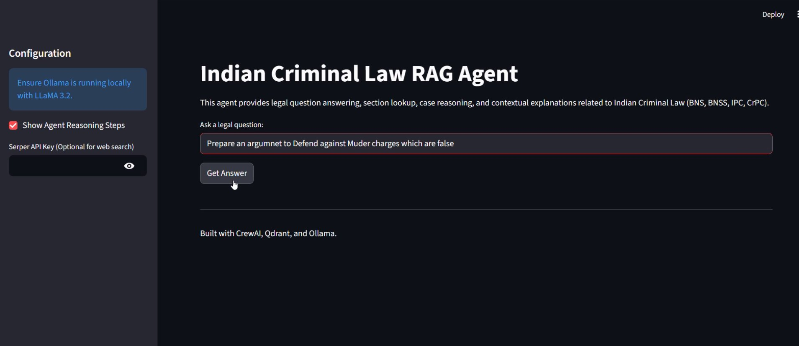
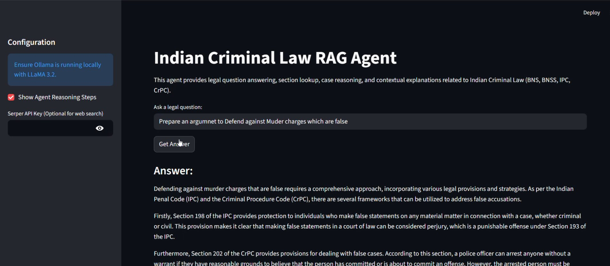
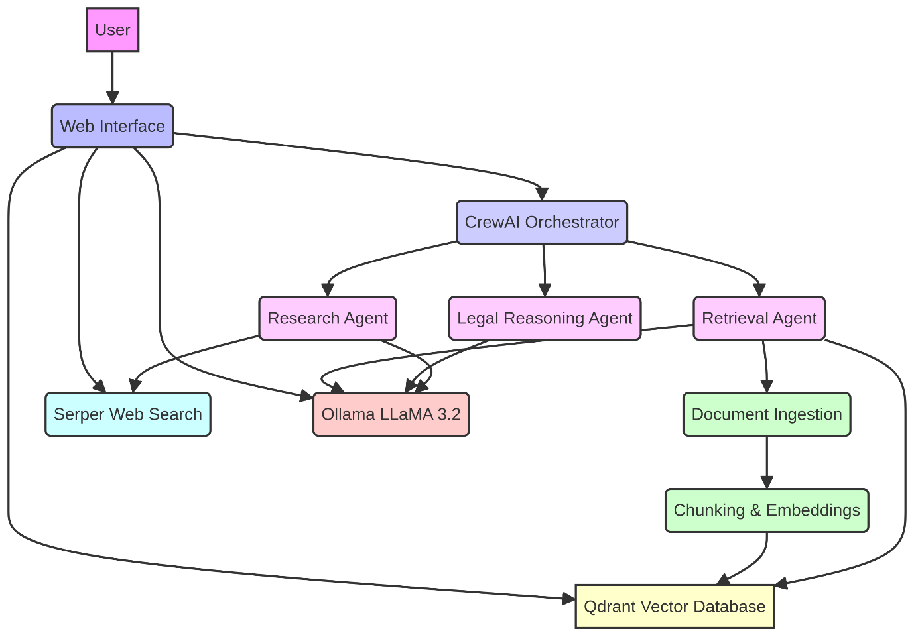
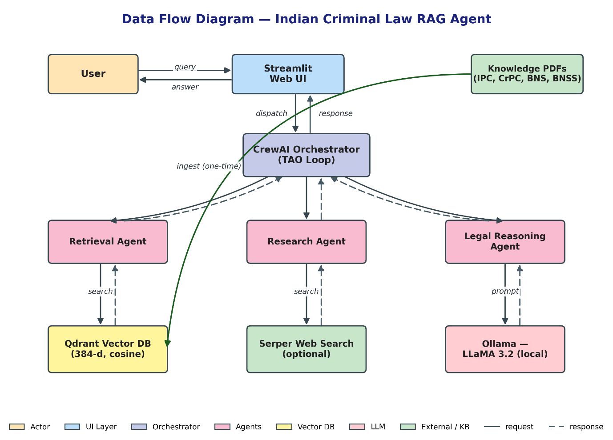
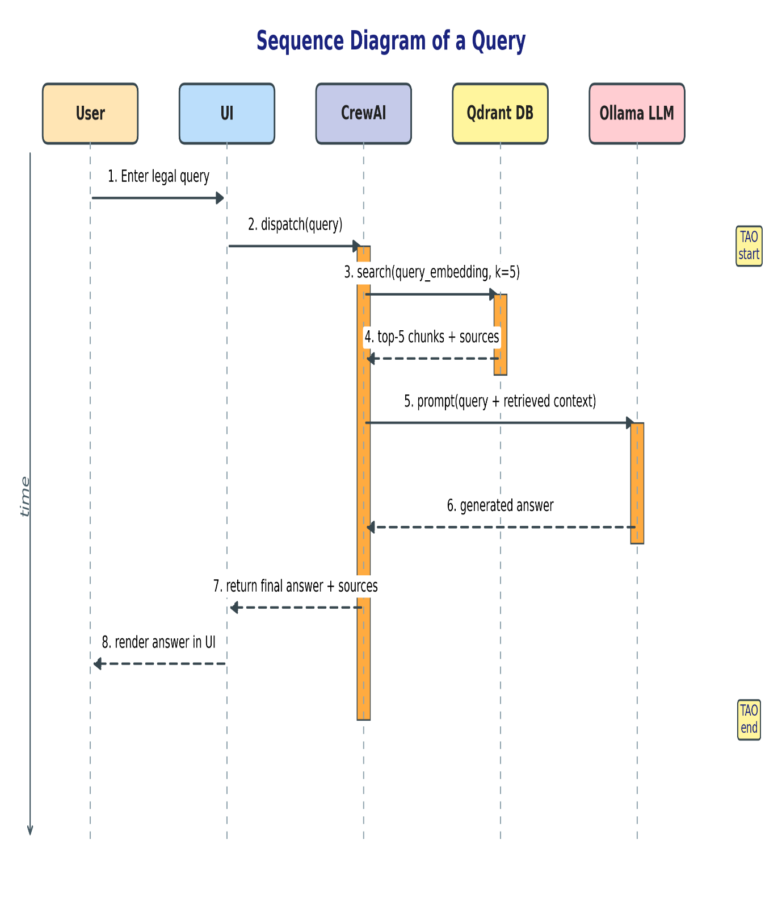
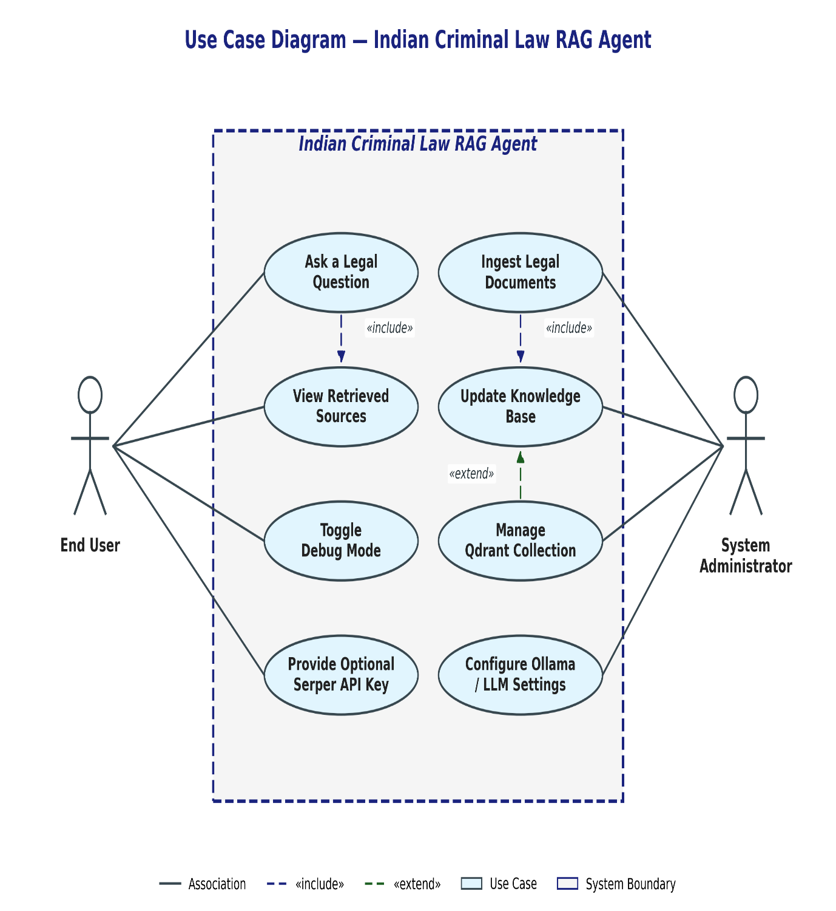
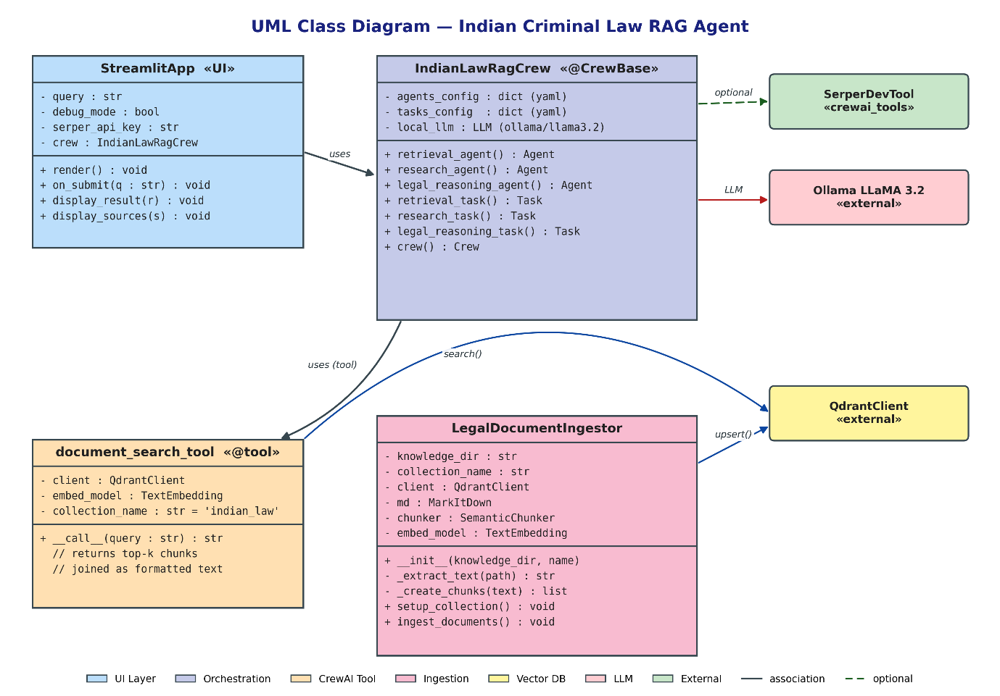
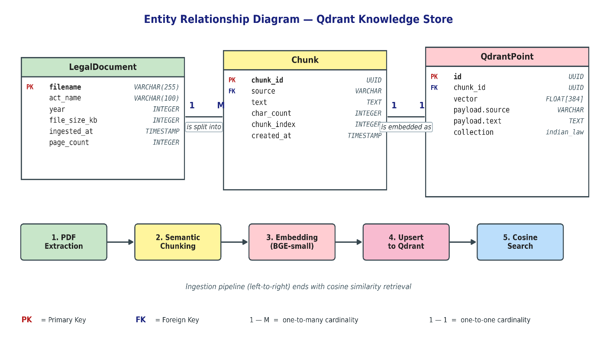
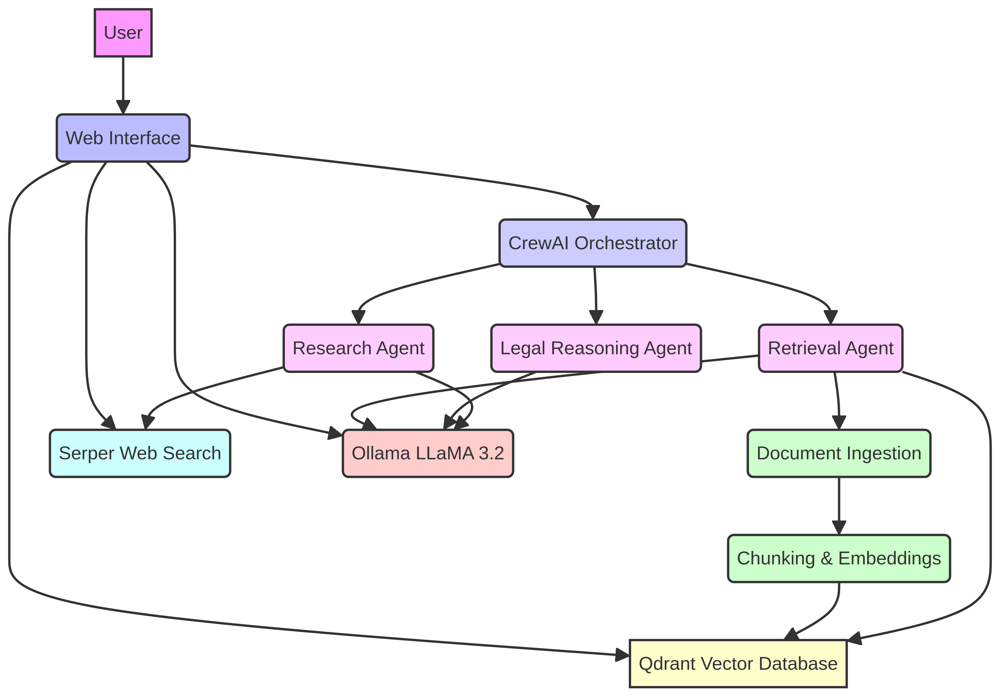

https://github.com/user-attachments/assets/faadeccb-82ed-4b70-b279-64ea9414d49b

<div align="center">

# ⚖️ Indian Criminal Law RAG Agent

**A fully local, open-source Retrieval-Augmented Generation (RAG) assistant for Indian Criminal Law — IPC, CrPC, BNS & BNSS.**

Ask natural-language legal questions and get grounded, citation-aware answers — 100% on your own machine, with no data ever leaving your computer.

[](https://www.python.org/)
[](https://docs.crewai.com)
[](https://qdrant.tech)
[](https://ollama.com)
[](https://streamlit.io)
[](LICENSE)
[](#-why-local)

[Features](#-features) · [Demo](#-demo) · [Architecture](#-architecture) · [Quick Start](#-quick-start) · [How It Works](#-how-it-works) · [Report](report.md)

</div>

---

## 📖 Overview

Indian criminal law is spread across the **Indian Penal Code (IPC)**, the **Code of Criminal Procedure (CrPC)**, the newly enacted **Bharatiya Nyaya Sanhita (BNS)** and **Bharatiya Nagarik Suraksha Sanhita (BNSS)**, and a vast body of case law. Searching across these scattered statutes is slow and error-prone.

The **Indian Criminal Law RAG Agent** combines a **vector database** with a **locally hosted LLM** to answer legal questions, look up sections, reason over cases, and produce contextual explanations — all grounded in the actual statutory text, and all running entirely on your machine.

Observed on representative queries: **~60–70% less research time**, **3–6 s** average response time, and **85–90%** retrieval accuracy.

> 📄 A full technical write-up (problem statement, design, UML diagrams, algorithms, testing, and results) is available in **[report.md](report.md)**.

---

## 🎥 Demo

<div align="center">

### ▶️ [**Watch the demo video**](https://github.com/Pratik2207/indian-criminal-law-rag-agent/blob/main/assets/demo.mp4)

*(opens GitHub's built-in video player)*

</div>

| Query input | Grounded answer with citations |
|:-----------:|:------------------------------:|
|  |  |

> 💡 **Want the video to play inline right here?** Edit this README on GitHub, drag-and-drop `assets/demo.mp4` into the editor, and replace the link above with the `…/assets/…` URL GitHub generates. That is the only way GitHub renders a native inline player.

---

## ✨ Features

- 🏛️ **Domain-specific RAG** — focused on IPC, CrPC, BNS, BNSS and related case laws.
- 🤖 **Agentic reasoning** — a Thought → Action → Observation (TAO) loop with three specialized CrewAI agents (Retrieval, Research, Legal Reasoning).
- 🔒 **100% local & private** — Ollama + Qdrant run on your machine; no query ever leaves your computer.
- 📑 **Source-grounded answers** — every response is backed by retrieved statutory chunks, reducing hallucination.
- 🌐 **Optional web search** — plug in a Serper API key to augment the local knowledge base.
- 🖥️ **Clean web UI** — a Streamlit interface for asking questions, viewing sources, and inspecting agent reasoning.
- 🧩 **Modular & reusable** — the ingestion pipeline and search tool are reusable for any domain-specific RAG project.

---

## 🏗️ Architecture

The system is organized into four logical tiers — **Presentation** (Streamlit), **Orchestration** (CrewAI), **Reasoning** (Ollama LLaMA 3.2) and **Data** (Qdrant + statute PDFs).

<div align="center">



*Layered system architecture*

</div>

| Tier | Components |
|------|-----------|
| **Presentation** | Streamlit Web UI (`app.py`) |
| **Orchestration** | CrewAI: Retrieval Agent · Research Agent · Legal Reasoning Agent |
| **Reasoning** | Ollama running LLaMA 3.2 (local LLM inference) |
| **Data** | Qdrant Vector Database · Knowledge PDFs (IPC, CrPC, BNS, BNSS) |

<details>
<summary><b>📊 More design diagrams (click to expand)</b></summary>

<br/>

| Data Flow Diagram | Sequence Diagram |
|:-----------------:|:----------------:|
|  |  |

| Use Case Diagram | Class Diagram | ER Diagram |
|:----------------:|:-------------:|:----------:|
|  |  |  |

**Component & data-flow overview**



A detailed narrative of the architecture is in [docs/architecture_explanation.md](docs/architecture_explanation.md).

</details>

---

## 🧰 Tech Stack

| Layer | Technology |
|-------|------------|
| **Agent Orchestration** | [CrewAI](https://docs.crewai.com) + crewai-tools |
| **LLM Inference** | [Ollama](https://ollama.com) running **LLaMA 3.2** (local) |
| **Vector Database** | [Qdrant](https://qdrant.tech) (local, persistent) |
| **Embeddings** | `BAAI/bge-small-en-v1.5` via [FastEmbed](https://github.com/qdrant/fastembed) (384-d, cosine) |
| **PDF Extraction** | [markitdown](https://github.com/microsoft/markitdown) |
| **Semantic Chunking** | [Chonkie](https://github.com/bhavnicksm/chonkie) (`minishlab/potion-base-8M`) |
| **Web Interface** | [Streamlit](https://streamlit.io) |
| **Web Search (optional)** | [Serper](https://serper.dev) |

---

## 🚀 Quick Start

### 1. Prerequisites

- **Python 3.11+**
- **[Ollama](https://ollama.com/download)** installed and running
- ~8 GB RAM (16 GB recommended)

### 2. Pull the LLM

```bash
ollama pull llama3.2
```

### 3. Install

```bash
git clone https://github.com/Pratik2207/indian-criminal-law-rag-agent.git
cd indian-criminal-law-rag-agent

python -m venv venv
# Windows:        venv\Scripts\activate
# macOS / Linux:  source venv/bin/activate

pip install -r requirements.txt
```

### 4. Configure

```bash
cp .env.example .env
```

Edit `.env` if needed (a Serper key is **optional** — leave it blank to run fully offline):

```ini
SERPER_API_KEY=          # optional, for web search
OLLAMA_BASE_URL=http://localhost:11434
OLLAMA_MODEL=llama3.2
QDRANT_DB_PATH=./qdrant_db
QDRANT_COLLECTION_NAME=indian_law
```

### 5. Ingest the statutes

Place the statute PDFs in `knowledge/` (IPC, CrPC, BNS, BNSS are included), then build the vector index:

```bash
python ingestion.py
```

> This extracts text, performs semantic chunking, generates embeddings, and stores them in a local Qdrant collection. It runs once and takes a few minutes.

### 6. Launch the app

```bash
streamlit run app.py
```

Open **http://localhost:8501** and ask a question, e.g. *"What is the punishment for theft under the IPC?"*

---

## 🔍 How It Works

```
User query
   │
   ▼
Streamlit UI ──► CrewAI Orchestrator (TAO loop)
                      │
      ┌───────────────┼────────────────────┐
      ▼               ▼                     ▼
 Retrieval Agent   Research Agent     Legal Reasoning Agent
      │               │                     │
      ▼               ▼                     ▼
  Qdrant DB      Serper (optional)     Ollama · LLaMA 3.2
 (top-5 chunks)                        (grounded answer)
                      │
                      ▼
            Grounded answer + cited sources ──► User
```

1. The query is embedded and matched against the Qdrant index; the **Retrieval Agent** returns the top-5 most relevant statutory chunks.
2. The **Research Agent** optionally augments with a web search (if a Serper key is set).
3. The **Legal Reasoning Agent** prompts LLaMA 3.2 with the query + retrieved context to compose a grounded, citation-aware answer.
4. The answer and its sources are rendered in the UI.

---

## 📂 Project Structure

```
indian-criminal-law-rag-agent/
├── app.py                      # Streamlit web interface
├── crew.py                     # CrewAI agents, tasks & crew definitions
├── tools.py                    # Qdrant-backed document search tool
├── ingestion.py                # PDF → chunk → embed → Qdrant pipeline
├── check_qdrant.py             # Utility to inspect the collection
├── requirements.txt
├── .env.example
├── report.md                   # Full technical project report
├── config/
│   ├── agents.yaml             # Agent role / goal / backstory configs
│   └── tasks.yaml              # Task definitions
├── knowledge/                  # Source statute PDFs (IPC, CrPC, BNS, BNSS)
├── assets/
│   └── demo.mp4                # Demo video
└── docs/
    ├── architecture_explanation.md
    ├── architecture.mmd        # Mermaid source for the architecture diagram
    └── figures/                # Diagrams & screenshots
```

---

## 🔐 Why Local?

Legal queries are inherently sensitive. By running the LLM (Ollama) and the vector store (Qdrant) entirely on your machine:

- ✅ No query, document, or answer ever leaves your computer.
- ✅ Zero recurring API cost.
- ✅ Works fully offline (web search is strictly opt-in).

---

## 🛠️ Troubleshooting

| Problem | Fix |
|---------|-----|
| **Ollama connection error** | Ensure Ollama is running and `ollama pull llama3.2` has completed. Check `OLLAMA_BASE_URL`. |
| **Qdrant errors** | Make sure `python ingestion.py` ran successfully. For a clean start, delete `qdrant_db/` and re-run ingestion. |
| **Dependency conflicts** | Upgrade pip (`pip install --upgrade pip`) and reinstall. |
| **Killed during ingestion** | Likely low memory — reduce `chunk_size` in `ingestion.py`. |
| **Web search not working** | Verify `SERPER_API_KEY` in `.env`. |

---

## 🗺️ Roadmap

- [ ] Multilingual support (Hindi, Marathi) via multilingual encoders
- [ ] Voice queries (speech-to-text)
- [ ] Live court-judgement / cause-list ingestion
- [ ] Hybrid BM25 + semantic retrieval
- [ ] Automatic citation verification against source PDFs

---

---

## 📜 License

Released under the [MIT License](LICENSE).

The included statute PDFs are public-domain Government of India publications.

---

> ⚠️ **Disclaimer:** This project is an educational and research tool. It does **not** constitute legal advice. Always verify any response with a qualified legal professional before relying on it.
