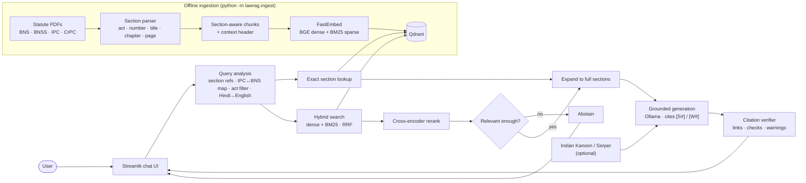

<div align="center">

# ⚖️ Indian Criminal Law RAG Agent

**A local, open-source RAG assistant for Indian criminal law: BNS, BNSS, IPC and CrPC.**

Ask legal questions in plain language and get grounded answers with **linked, verified citations**.<br/>
Runs entirely on your own machine, on a 4 GB laptop GPU; web and case-law search are opt-in.

[](https://www.python.org/)
[](https://qdrant.tech)
[](https://ollama.com)
[](https://streamlit.io)
[](#-evaluation)
[](LICENSE)

[Features](#-features) · [Architecture](#-architecture) · [Quick start](#-quick-start) · [Evaluation](#-evaluation) · [Project structure](#-project-structure) · [Improvement report](docs/IMPROVEMENT_REPORT.md)

</div>

---

## 📖 Overview

Indian criminal law spans the **Indian Penal Code (IPC)** and **Code of Criminal Procedure (CrPC)**, and their replacements from 1 July 2024: the **Bharatiya Nyaya Sanhita (BNS)** and **Bharatiya Nagarik Suraksha Sanhita (BNSS)**. Lawyers and students constantly need to find the right section, and its old/new equivalent.

This assistant does that, grounded in the statute text:
- It parses the four Acts into **sections** (act, number, title, chapter, page).
- It finds the relevant ones with **hybrid search and reranking**.
- It answers with a local LLM that must **cite a source after every claim**.
- It **checks** those citations before showing them.

**Measured on a 107-question test set:**
- The correct section is in the top 5 results for **88.8%** of questions; the original version managed 18.7%.
- **90%** of answers cite the expected section with the default 3B model (97% with qwen3:8b).
- **No** answer cites a section that doesn't exist.

## ✨ Features

- 🔗 **Linked citations.** Every `[S1]` in an answer becomes a link to the exact page of the statute PDF. The sources panel adds the official India Code page and an Indian Kanoon search link for the section and related case law.
- ✅ **Citation verification.** Flags:
  - sections that don't exist in the Acts;
  - sections mentioned but not retrieved;
  - sentences that name one section but cite another;
  - old↔new correspondences that contradict the official table.
- 🔁 **IPC ↔ BNS and CrPC ↔ BNSS mapping.** Ask about "IPC 302" and you also get BNS 103, from the official correspondence tables (1,074 pairs).
- 🎯 **Exact lookup and deterministic mapping.** "Show me Section 103 of BNS" is answered from the section itself. "What is IPC 302 in BNS?" is resolved from the official table (shown in a 📌 banner), and the LLM only explains the section.
- 🧭 **Section-aware hybrid retrieval.** Dense (BGE) and BM25 search, fused, then reranked by a cross-encoder. Matched chunks are expanded to the full section, so details like a punishment in sub-section (2) aren't lost.
- 🌐 **Optional case law and web search.** Indian Kanoon API and Serper, limited to trusted legal domains. Every result is cited with its URL.
- 🛑 **Abstains when out of scope.** "How do I register a trademark?" gets "not found in these Acts", not a guess.
- 💬 **Chat UI.** Streaming answers, follow-up questions, a sources panel and 👍/👎 feedback logging.
- 🤖 **Optional agentic mode.** A CrewAI researcher + writer that chooses its own searches, with the same citation checks.
- 📏 **Evaluation harness.** Retrieval and generation evals over a 112-question golden set, with saved results.

## 🏗️ Architecture


```mermaid
flowchart LR
    subgraph Ingestion["Offline ingestion  (python -m lawrag.ingest)"]
        PDF["Statute PDFs<br/>BNS · BNSS · IPC · CrPC"] --> P["Section parser<br/>act · number · title · chapter · page"]
        P --> C["Section-aware chunks<br/>+ context header"]
        C --> E["FastEmbed<br/>BGE dense + BM25 sparse"]
        E --> Q[("Qdrant")]
    end

    U(["User"]) --> UI["Streamlit chat UI"]
    UI --> A["Query analysis<br/>section refs · IPC↔BNS map · act filter · Hindi→English"]
    A --> X["Exact section lookup"]
    A --> H["Hybrid search<br/>dense + BM25 · RRF"]
    X --> Q
    H --> Q
    H --> R["Cross-encoder rerank"]
    R --> T{"Relevant enough?"}
    T -- no --> AB["Abstain"]
    T -- yes --> F["Expand to full sections"]
    X --> F
    W["Indian Kanoon / Serper<br/>(optional)"] --> G
    F --> G["Grounded generation<br/>Ollama · cites [S#] / [W#]"]
    G --> V["Citation verifier<br/>links · checks · warnings"]
    V --> UI
    AB --> UI
```

| Layer | Implementation |
|---|---|
| **UI** | `app.py`: Streamlit chat, streaming, sources panel, feedback, agentic-mode toggle |
| **Pipeline** | `lawrag/answer.py`: retrieve → abstain? → expand → generate → verify |
| **Retrieval** | `lawrag/retrieval.py`: query analysis, exact lookup, hybrid search, rerank |
| **Citations** | `lawrag/citations.py`: tag → link, verification checks |
| **Ingestion** | `lawrag/parser.py`, `lawrag/ingest.py`: PDF → sections → chunks → vectors |
| **LLM** | Ollama, default **`qwen2.5:3b`** (fits fully on a 4 GB GPU; any Ollama model via `OLLAMA_MODEL`) |
| **Vector store** | Qdrant, local files by default or a server via `QDRANT_URL` |

The full story (what was wrong in v1, every fix, and measured before/after numbers) is in **[docs/IMPROVEMENT_REPORT.md](docs/IMPROVEMENT_REPORT.md)**.

## 🚀 Quick start

**Prerequisites:** Python 3.11+, [Ollama](https://ollama.com/download), ~8 GB RAM. A GPU is optional; 4 GB of VRAM is enough for the default model.

```bash
git clone https://github.com/Pratik2207/indian-criminal-law-rag-agent.git
cd indian-criminal-law-rag-agent

python -m venv .venv
# Windows: .venv\Scripts\activate      macOS/Linux: source .venv/bin/activate
pip install -r requirements.txt          # + requirements-dev.txt for tests and evals

cp .env.example .env                     # Windows: copy .env.example .env
ollama pull qwen2.5:3b

python -m lawrag.ingest --rebuild        # build the index (~8 min on a laptop CPU)
python scripts/check_index.py            # expect 2,604 points
streamlit run app.py                     # open http://localhost:8501
```

Try asking *"What is IPC 302 called in BNS?"* or *"When can police arrest without a warrant?"*

**Optional keys** in `.env`: `SERPER_API_KEY` (web search) and `INDIAN_KANOON_API_TOKEN` (case law). Then switch on **Search case law and the web** in the sidebar.

### Choosing a model

The default is **`qwen2.5:3b`**: it fits entirely in 4 GB of VRAM at the 6k context the app uses. Measured on 30 questions (laptop GTX 1650, 4 GB):

| Model (`OLLAMA_MODEL`) | On GPU | Median answer time | Gold section cited | Citation precision |
|---|---|---|---|---|
| **`qwen2.5:3b`** (default) | 100% | **14 s** | 90% | 0.99 |
| `qwen3:8b` (best with 8 GB+ VRAM) | 36% | 96 s | 97% | 0.95 |
| `llama3.2` (3B) | 68% | 22 s | 83% | 0.93 |
| `qwen3:4b` | 60% | not evaluated (~18 tok/s vs 56 tok/s for qwen2.5:3b) | | |

No model cited a non-existent section. With a bigger GPU, set `OLLAMA_MODEL=qwen3:8b`. Re-run `python -m evals.generation_eval --model <name>` to check any other model.

## 📏 Evaluation

```bash
pip install -r requirements-dev.txt
python -m evals.retrieval_eval --configs dense hybrid hybrid_rerank full     # retrieval, a few minutes
python -m evals.generation_eval --n 30 --model qwen2.5:3b                    # answers and citations
python -m evals.rescore_generation evals/results/*_generation_*.json        # re-score saved runs, no LLM
pytest -q                                                                    # unit tests
```

The golden set has 60 hand-written questions (concepts, procedure, IPC↔BNS mapping, section lookup, Hindi, out-of-scope), each with gold sections checked against the statute text. It also has 52 synthetic questions generated from section texts.

| Retrieval configuration | Hit@1 | Hit@5 | MRR@10 | Recall@5 |
|---|---|---|---|---|
| v1 as shipped (embedding-model mismatch, broken BNS extraction) | 0.150 | 0.187 | 0.168 | 0.118 |
| Re-indexed, section-aware, dense only | 0.533 | 0.701 | 0.611 | 0.674 |
| + BM25 hybrid | 0.533 | 0.776 | 0.632 | 0.751 |
| + cross-encoder rerank | 0.561 | 0.860 | 0.684 | 0.813 |
| **+ query analysis (current)** | **0.617** | **0.888** | **0.726** | **0.855** |

## 📂 Project structure

```
├── app.py                      # Streamlit chat UI (entry point)
├── lawrag/                     # core package
│   ├── config.py               #   settings from .env (pydantic-settings)
│   ├── parser.py               #   PDF → sections (Gazette and India Code layouts)
│   ├── ingest.py               #   sections → chunks → dense + sparse vectors → Qdrant
│   ├── retrieval.py            #   query analysis, exact lookup, hybrid search, rerank
│   ├── answer.py               #   end-to-end answering, abstention, prompt
│   ├── citations.py            #   [S#] → links, citation verification
│   ├── web_search.py           #   Indian Kanoon + Serper (keeps URLs)
│   ├── crew.py                 #   optional CrewAI agentic mode (prompts/*.yaml)
│   └── embeddings.py · llm.py · store.py
├── data/
│   ├── statutes/               # BNS, BNSS, IPC, CrPC PDFs
│   └── section_map.csv         # official IPC↔BNS / CrPC↔BNSS correspondence
├── scripts/                    # check_index.py, build_section_map.py
├── evals/                      # golden sets, eval scripts, saved results
├── tests/                      # unit tests
└── docs/                       # IMPROVEMENT_REPORT.md, architecture.mmd, v1 design docs
```

## 🛠️ Troubleshooting

| Problem | Fix |
|---|---|
| Answers are slow | Use a model that fits in your VRAM (see *Choosing a model*); check with `ollama ps` (the "PROCESSOR" column should say 100% GPU). |
| `Storage folder … is already accessed by another instance` | The local DB allows one process at a time: close the app before running ingestion or evals, or run a Qdrant server and set `QDRANT_URL`. |
| Ollama connection error | Start Ollama, `ollama pull <OLLAMA_MODEL>`, and check `OLLAMA_BASE_URL`. |
| `Collection 'indian_law_v2' not found` | Run `python -m lawrag.ingest --rebuild`. |
| Citation links don't open | Keep `.streamlit/config.toml` (`enableStaticServing = true`); the app copies the PDFs to `static/` on start. |

## 🗺️ Roadmap

- [x] Section-aware hybrid retrieval with reranking
- [x] Linked citations and automatic citation verification
- [x] IPC ↔ BNS / CrPC ↔ BNSS mapping
- [x] Retrieval and generation evaluation harness
- [ ] Automatic repair of citations flagged by the verifier
- [ ] Native multilingual retrieval (e.g. `BAAI/bge-m3`) instead of query translation
- [ ] Bharatiya Sakshya Adhiniyam / Indian Evidence Act
- [ ] Offence-date-aware routing (IPC/CrPC before 1 July 2024, BNS/BNSS after)

<details>
<summary><b>📚 Original (v1) design documents</b></summary>

<br/>

The first version used a three-agent CrewAI pipeline. Its academic report and UML diagrams are kept for reference: **[report.md](report.md)**, [docs/architecture_explanation.md](docs/architecture_explanation.md) and [docs/figures/](docs/figures/). See the improvement report for why the design changed.

</details>

## 📜 License

[MIT](LICENSE). The statute PDFs are public Government of India publications.

> ⚠️ **Disclaimer:** an educational and research tool, **not legal advice**. Verify answers against the official text and consult a qualified lawyer.
