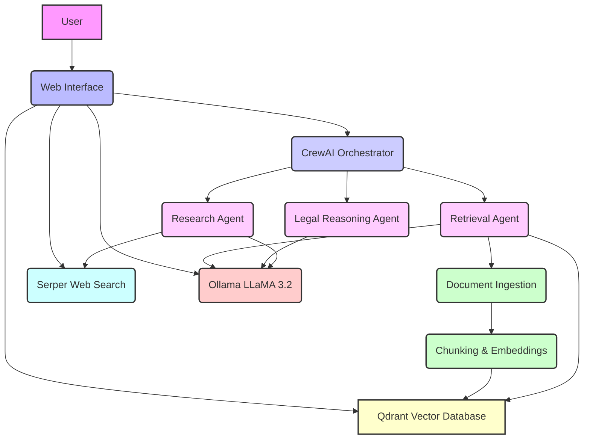

# Indian Criminal Law RAG Agent Architecture

This document outlines the system architecture for the fully local, open-source Indian Criminal Law RAG Agent. The design emphasizes modularity, agentic reasoning, and adherence to the specified technology constraints.

## 1. Overview

The RAG Agent is designed to provide legal question answering, section lookup, case reasoning, and contextual explanations related to Indian Criminal Law. It leverages a multi-agent orchestration framework (CrewAI) with a Thought-Action-Observation (TAO) loop for enhanced reasoning capabilities. All components run locally, utilizing open-source technologies.

## 2. System Components

The architecture comprises the following key components:

*   **User Interface (WebUI)**: A simple web-based interface for user interaction, allowing legal questions to be asked, retrieved sources to be viewed, and agent reasoning steps to be observed (optional debug mode).
*   **CrewAI Orchestrator**: The central component responsible for managing and orchestrating the various agents. It implements the TAO loop for agentic reasoning.
*   **Agents (Research, Legal Reasoning, Retrieval)**: Specialized agents within the CrewAI framework:
    *   **Research Agent**: Responsible for conducting web searches using Serper for external information and interacting with the Ollama LLM for general knowledge or initial understanding.
    *   **Legal Reasoning Agent**: Focuses on applying legal reasoning to the retrieved information and generating contextual explanations, utilizing the Ollama LLM.
    *   **Retrieval Agent**: Manages the interaction with the Qdrant Vector Database to retrieve relevant legal documents based on user queries. It also initiates the document ingestion process.
*   **Document Ingestion**: A pipeline for processing raw legal documents (PDFs of IPC, CrPC, BNS, BNSS, case laws).
*   **Chunking & Embeddings**: This module takes ingested documents, breaks them into manageable chunks, and generates vector embeddings for each chunk. These embeddings are crucial for efficient semantic search.
*   **Qdrant Vector Database**: A local, open-source vector database used to store the generated document embeddings and their associated metadata. It enables fast and accurate retrieval of relevant legal document chunks.
*   **Ollama with LLaMA 3.2**: The chosen Large Language Model (LLM) for all inference tasks, including question answering, reasoning, and explanation generation. It runs 100% locally.
*   **Serper Web Search**: An external tool used by the Research Agent to perform web searches, primarily for information not found in the local knowledge base or for cross-referencing.

## 3. Agentic Reasoning (TAO Loop)

The core of the agent's intelligence lies in its Thought-Action-Observation (TAO) loop, orchestrated by CrewAI. This loop allows agents to:

1.  **Think**: Analyze the current task and formulate a plan.
2.  **Act**: Execute tools (e.g., DocumentSearchTool, SerperDevTool) or interact with other agents to gather information or perform specific operations.
3.  **Observe**: Evaluate the results of their actions and update their internal state, leading to further thoughts and actions until the task is completed.

## 4. Data Flow

1.  **Document Ingestion**: Raw legal documents are fed into the Document Ingestion pipeline.
2.  **Chunking & Embeddings**: Documents are chunked, and embeddings are generated, then stored in the Qdrant Vector Database.
3.  **User Query**: A user submits a legal question via the WebUI.
4.  **CrewAI Orchestration**: The CrewAI Orchestrator receives the query and assigns it to appropriate agents.
5.  **Retrieval**: The Retrieval Agent queries the Qdrant Vector Database to find relevant document chunks.
6.  **Research**: The Research Agent may perform web searches via Serper if necessary.
7.  **Reasoning**: The Legal Reasoning Agent and Research Agent utilize the Ollama LLM to process retrieved information, apply legal reasoning, and formulate answers.
8.  **Response Generation**: The Ollama LLM generates the final response, which is then displayed to the user via the WebUI, along with retrieved sources and (optionally) agent reasoning steps.

## 5. Architecture Diagram

## 6. Technology Stack

*   **Orchestration**: CrewAI
*   **LLM Inference**: Ollama with LLaMA 3.2
*   **Vector Database**: Qdrant (local instance)
*   **Web Search**: Serper (API for web search, though the final solution aims for local search where possible)
*   **Document Processing**: Custom ingestion, chunking, and embedding modules.
*   **Web Interface**: To be implemented using a suitable Python web framework (e.g., Flask or FastAPI with a simple frontend).

This architecture ensures a robust, scalable, and fully open-source solution for the Indian Criminal Law RAG Agent.
